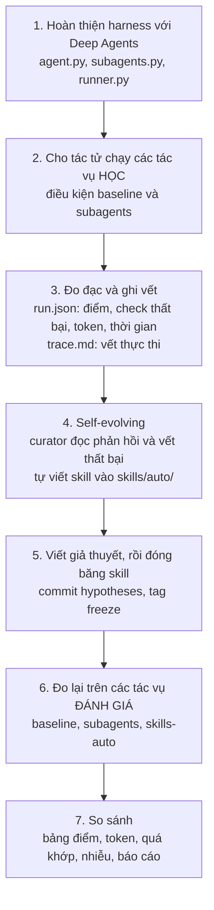

# Self evolving Agentic

Lab về bộ khung điều khiển tác tử (Agent Harness) với Deep Agents, tác tử tự tiến hóa (Self-Evolving Agent) và đa tác tử (Multi-Agent).

Hình thức: **bài thực hành cá nhân**. Mỗi sinh viên tự làm, tự chạy thí nghiệm và nộp bài, báo cáo riêng. Ngôn ngữ lập trình: Python 3.11 trở lên.

## 1. Mục tiêu học tập

Sau lab, sinh viên có khả năng:

1. Dựng một tác tử bằng thư viện Deep Agents (LangChain) và mô tả các thành phần của bộ khung điều khiển (harness): công cụ (tool), môi trường thực thi (backend), system prompt, tác tử con (subagent), kỹ năng (skill).
2. Xây dựng quy trình chạy thí nghiệm có thể lặp lại: cô lập môi trường (sandbox), đo token, thời gian, số lần gọi công cụ, chấm điểm tự động, ghi vết (trace).
3. Cho tác tử tự tiến hóa ở tầng ngữ cảnh (context layer): bộ tuyển chọn (curator) đọc phản hồi và vết thất bại rồi tự viết skill.
4. Đánh giá đúng cách một cải tiến: tách tập học (learning set) và tập đánh giá (evaluation set), đóng băng (freeze) skill trước khi đánh giá, nhận diện quá khớp (overfitting) và rò rỉ dữ liệu (data leakage).
5. So sánh chi phí và hiệu quả của đa tác tử (subagent) và của skill tự sinh với tác tử mặc định.

## 2. Thiết kế thí nghiệm

### 2.1. Quy trình tổng thể



Ba điều kiện được so sánh (condition):

| Điều kiện | Mô tả |
|---|---|
| `baseline` | Tác tử Deep Agents mặc định, không có skill. Đường cơ sở. |
| `subagents` | Thêm các subagent do bạn định nghĩa (đa tác tử). |
| `skills-auto` | Nạp skill do curator tự sinh từ phản hồi và vết của tác vụ học (tác tử tự tiến hóa). |

### 2.2. Tác vụ (task) và cách đánh giá thành công hay thất bại

**Có 3 họ tác vụ (family), mỗi họ có 2 tác vụ: 1 tác vụ học và 1 tác vụ đánh giá. Tổng cộng 6 tác vụ.** Mỗi tác vụ là một thư mục `tasks/<id>/` gồm đề bài (`instruction.md`), dữ liệu (`workspace/`) và bộ kiểm tra tự động (`check.py`). Tác vụ đánh giá có cùng loại việc và dùng lại các quy ước của tác vụ học, nhưng khác dữ liệu và thêm một quy ước mới.

| Họ | Tác vụ học | Tác vụ đánh giá | Tác vụ là gì |
|---|---|---|---|
| `code` | `code-learn` | `code-eval` | Sửa một gói Python nhỏ đang có test lỗi. Lỗi gốc nằm ở hàm dùng chung, và có lỗi chỉ thấy khi đối chiếu docstring. |
| `data` | `data-learn` | `data-eval` | Trả lời câu hỏi có đáp án chính xác từ tệp CSV/JSON bẩn (dòng trùng, giá trị thiếu, nhiều định dạng ngày, múi giờ) và ghi `answer.json`, `clean.csv`. |
| `logs` | `logs-learn` | `logs-eval` | Phân tích tệp log (stack trace nhiều dòng, dòng lặp, nhiều cách viết mức log, múi giờ) thành `errors.json`. |

**Cách chấm:** `check.py` chạy một danh sách phép kiểm tra (check) trên thư mục làm việc mà tác tử đã sửa. Mỗi check chỉ có hai kết quả là đạt hoặc không đạt.

- **Thành công** của một tác vụ: đạt toàn bộ check (điểm 1,0).
- **Thất bại**: có ít nhất một check không đạt.
- **Điểm tác vụ** = số check đạt / tổng số check (chấm từng phần - partial credit). Báo cáo dùng điểm này để so sánh.

## 3. Cấu trúc thư mục

```text
<tên-kho>/
├── README.md              Tài liệu này
├── GUIDE.md               Hướng dẫn thực hiện từng bước
├── RUBRIC.md              Thang điểm 100
├── GLOSSARY.md            Bảng thuật ngữ
├── REPORT_TEMPLATE.md     Mẫu báo cáo
├── pyproject.toml         Khai báo thư viện
├── .env.example           Mẫu cấu hình khóa API
├── Dockerfile             (tùy chọn) chạy trong container
├── guides/pseudocode/     Pseudo-code cho từng module sinh viên phải cài đặt
├── src/lab/               Mã nguồn
│   ├── model.py, tasks.py, grading.py, testing.py, compare.py   Có sẵn, không sửa
│   └── agent.py, subagents.py, runner.py, curator.py             SINH VIÊN CÀI ĐẶT (mỗi tệp còn vài hàm TODO)
├── tasks/                 6 tác vụ (workspace, instruction.md, check.py)
├── tests/                 Bộ test ngoại tuyến (offline), không tốn token
├── scripts/               tour.py (xem công cụ mặc định), verify_freeze.py (kiểm tra đóng băng), check_breakdown.py (thống kê check)
├── skills/auto/           Skill do curator tự sinh
├── report/                Báo cáo của sinh viên (bạn tạo ở Phần 0: REPORT.md, table.md)
└── results/               Kết quả các lần chạy (chương trình ghi)
```

## 4. Cài đặt

Yêu cầu: Python 3.11 trở lên; hệ điều hành macOS hoặc Linux (trên Windows dùng WSL hoặc Docker, vì shell của tác tử dùng `/bin/sh`); **API key và nhà cung cấp mô hình do sinh viên tự chuẩn bị** (giảng viên không cấp khóa).

```bash
git clone <URL-kho-mã-nguồn> && cd <tên-kho>
python3 -m venv .venv && source .venv/bin/activate
pip install -e .
cp .env.example .env
mkdir -p report && cp REPORT_TEMPLATE.md report/REPORT.md
pytest tests/test_01_provided.py
```

### Cấu hình mô hình (tự chuẩn bị)

Sinh viên dùng khóa và nhà cung cấp của riêng mình. Điền `.env` (sao chép từ `.env.example`) theo một trong hai cách:

1. **Nhà cung cấp có sẵn trong LangChain:** `LAB_MODEL=<nhà-cung-cấp>:<tên-model>` và biến khóa của nhà cung cấp đó. Ví dụ `openai:<tên-model>` với `OPENAI_API_KEY`, `anthropic:<tên-model>` với `ANTHROPIC_API_KEY`, `google_genai:<tên-model>` với `GOOGLE_API_KEY`.
2. **Bất kỳ endpoint tương thích OpenAI** (OpenRouter, Together, Groq, Ollama hoặc vLLM chạy trên máy, ...): `LAB_BASE_URL`, `LAB_MODEL` và `LAB_API_KEY` (có thể bỏ trống với máy chủ cục bộ).

Yêu cầu với mô hình: **hỗ trợ gọi công cụ (tool calling)**. Nên chọn mô hình nhỏ, giá thấp để tiết kiệm token; mô hình quá yếu hoặc không gọi công cụ ổn định sẽ cho kết quả không đại diện. Tên mô hình thay đổi theo thời gian: lấy từ tài liệu của nhà cung cấp. Khóa API chỉ nằm trong `.env`, không commit và không dán vào báo cáo.

Kết quả mong đợi của `pytest tests/test_01_provided.py`: `15 passed`. Không commit tệp `.env`.

## 5. Sản phẩm nộp

Mỗi sinh viên nộp bài riêng, qua kho mã nguồn (git) của chính mình, gồm:

1. Mã nguồn đã cài đặt trong `src/lab/` (4 tệp: `agent.py`, `subagents.py`, `runner.py`, `curator.py`; chỉ các hàm đánh dấu TODO).
2. `skills/auto/`.
3. `results/` (đủ `run.json` và `trace.md` của các lần chạy dùng trong báo cáo).
4. `report/REPORT.md` và `report/table.md`.

Thang điểm chi tiết: xem `RUBRIC.md`.